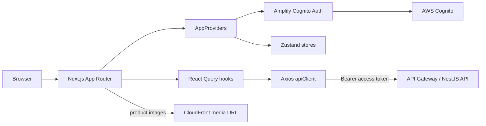
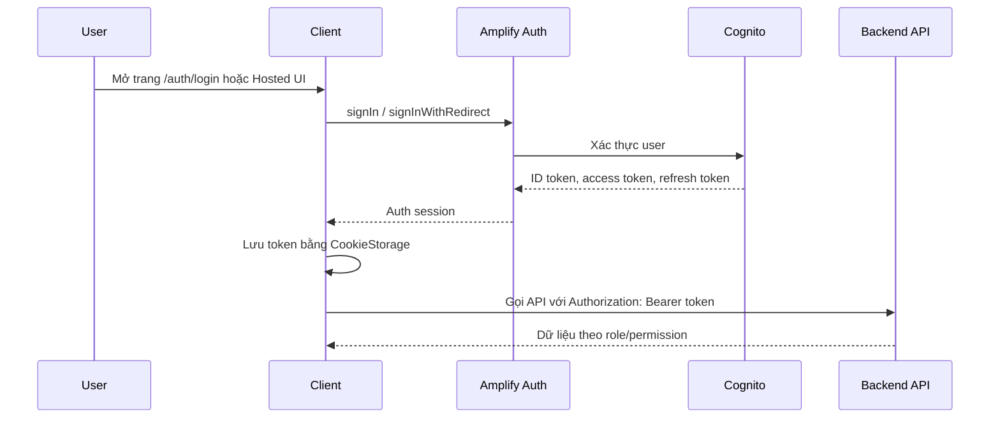
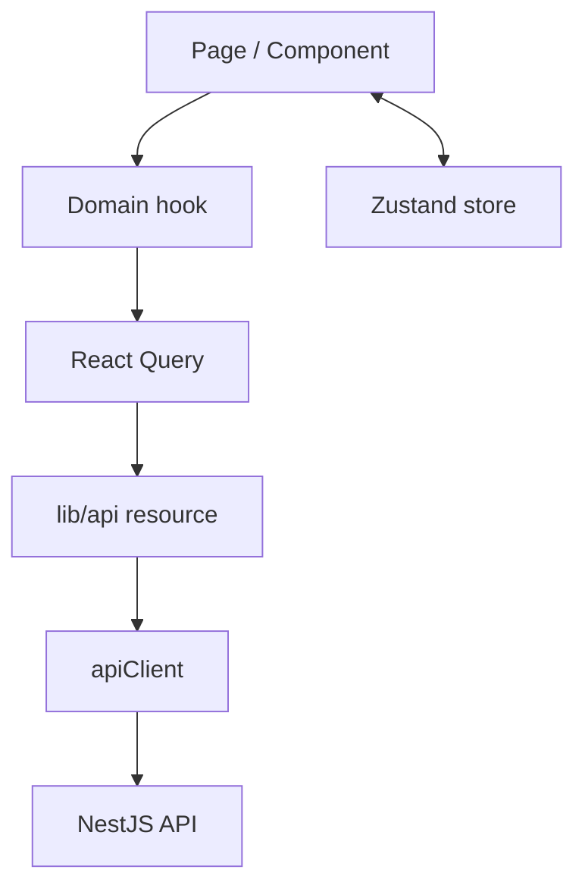

# E-commerce Client

Client là ứng dụng web Next.js cho hệ thống e-commerce học DynamoDB/AWS. Ứng dụng được tổ chức thành hai khu vực chính:

- Customer storefront: xem danh mục, chi tiết sản phẩm, giỏ hàng, checkout, lịch sử đơn hàng và hồ sơ cá nhân.
- Admin dashboard: quản lý sản phẩm, danh mục, tồn kho, đơn hàng, tài khoản người dùng, phân quyền và theo dõi email.

## Công nghệ chính

| Thành phần                            | Vai trò                                                |
| ------------------------------------- | ------------------------------------------------------ |
| Next.js App Router                    | Routing, layout và static export cho frontend.         |
| React 19                              | Xây dựng UI component.                                 |
| AWS Amplify Auth                      | Tích hợp Cognito, Hosted UI, token và phiên đăng nhập. |
| Axios                                 | HTTP client gọi API backend.                           |
| React Query                           | Quản lý server state, cache và refetch dữ liệu.        |
| Zustand                               | Quản lý client state như auth snapshot và cart state.  |
| nuqs                                  | Đồng bộ query string với trạng thái filter/pagination. |
| shadcn/ui, Tailwind CSS, lucide-react | UI primitives, styling và icon.                        |

## Kiến trúc tổng quan



### Các lớp trong client

- `src/app`: định nghĩa route theo App Router, gồm public storefront, auth pages và admin pages.
- `src/components`: UI theo domain (`products`, `orders`, `categories`, `inventories`, `users`, `customer`, `layout`, `email`) và component nền tảng trong `components/ui`.
- `src/hooks`: hooks gom logic đọc/ghi dữ liệu, filter, pagination và guard auth.
- `src/lib/api`: các API wrapper theo resource. Tất cả đi qua `api-client.ts`.
- `src/lib/auth.ts`: cấu hình Amplify, đăng nhập/đăng xuất, Hosted UI, callback, refresh token và decode claims.
- `src/lib/env.ts`: đọc các biến môi trường public cần thiết khi build/chạy app.
- `src/store`: state cục bộ cho auth và cart.

## Luồng xác thực



`AppProviders` gọi `configureAmplify()` và hydrate `auth-store` khi app chạy trên browser. `api-client.ts` tự lấy access token trước mỗi request. Nếu backend trả `401` do token hết hạn, client thử refresh token một lần; nếu refresh thất bại thì đăng xuất và chuyển về `/auth/login`.

## Luồng dữ liệu



- Dữ liệu server như products, categories, carts, orders, inventories và users được đọc qua React Query hooks.
- Trạng thái client như session auth và cart snapshot nằm trong Zustand để các layout/page cùng sử dụng.
- Filter và pagination trên catalog/inventory dùng query params để có thể share URL và refresh trang không mất trạng thái.

## Routing chính

| Nhóm route                                                               | Mục đích                                                                         |
| ------------------------------------------------------------------------ | -------------------------------------------------------------------------------- |
| `/`, `/products/[id]`                                                    | Storefront và chi tiết sản phẩm.                                                 |
| `/cart`, `/checkout`, `/checkout/result`, `/orders`, `/orders/[orderId]` | Giỏ hàng, thanh toán và lịch sử đơn hàng.                                        |
| `/auth/*`                                                                | Login, signup, confirm, callback, forgot password, set password.                 |
| `/customer/profile`                                                      | Hồ sơ khách hàng.                                                                |
| `/admin/*`                                                               | Dashboard quản trị sản phẩm, danh mục, tồn kho, đơn hàng, user và profile admin. |

`next.config.ts` cấu hình `output: 'export'` để build ra static site. Khi chạy development server, một số dynamic route có rewrite fallback để tiện thử nghiệm cục bộ.

## Biến môi trường

Client đọc các biến public sau:

| Biến                                     | Ý nghĩa                                             |
| ---------------------------------------- | --------------------------------------------------- |
| `NEXT_PUBLIC_API_GATEWAY_BASE_URL`       | Base URL của backend API.                           |
| `NEXT_PUBLIC_MEDIA_PUBLIC_BASE_URL`      | Base URL public cho ảnh/media từ CloudFront.        |
| `NEXT_PUBLIC_COGNITO_REGION`             | AWS region của Cognito.                             |
| `NEXT_PUBLIC_COGNITO_USER_POOL_ID`       | Cognito User Pool ID.                               |
| `NEXT_PUBLIC_COGNITO_CLIENT_ID`          | Cognito App Client ID.                              |
| `NEXT_PUBLIC_COGNITO_DOMAIN_URL`         | Cognito Hosted UI domain.                           |
| `NEXT_PUBLIC_COGNITO_USER_POOL_ENDPOINT` | Endpoint Cognito, hỗ trợ cả AWS thật và LocalStack. |

Thông thường các giá trị này được đồng bộ từ output của server stack bằng script trong thư mục `server`.

## Chạy local

```bash
npm install
npm run dev
```

Mở <http://localhost:8000> nếu dev server đang dùng port 8000. Nếu Next.js chọn port khác, dùng URL mà terminal hiển thị.

Các lệnh hữu ích:

```bash
npm run build
npm run start
npm run lint
npm run format
npm run format:check
```

## Build và deploy

Client được build static bằng Next.js export:

```bash
npm run build
```

Trong luồng AWS của dự án, deploy client thường chạy từ thư mục `server`:

```bash
npm run infra:deploy:client
```

Luồng này đồng bộ env cho client, build `client/out`, upload static asset lên S3 và phân phối qua CloudFront bằng `ClientDevStack`.
